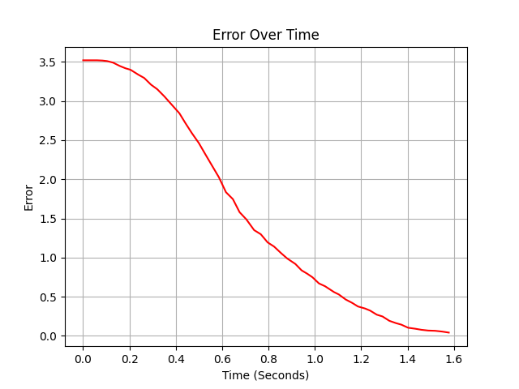
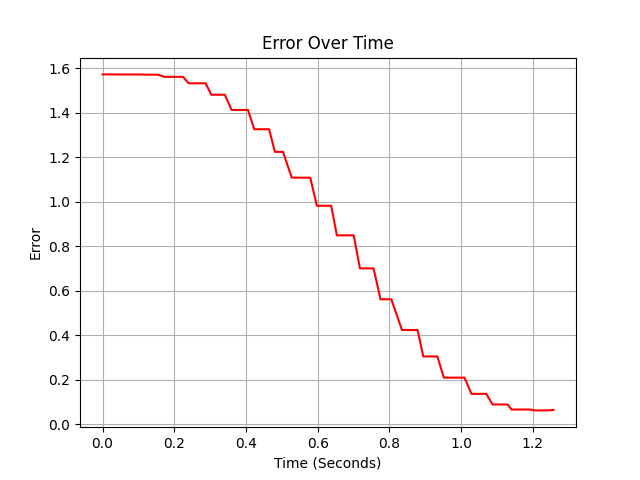

# Code Details and Versions

- Download Old Code as [.py](https://loamy88.github.io/VexNoteBook/code/autonomous/110%20Autonomous.py) or [.iqpython](https://loamy88.github.io/VexNoteBook/code/autonomous/110%20-%20Autonomous%20-%20Working.iqpython) - ([View On Github](./110%20Autonomous.py))
- Download New Code as [.py](https://loamy88.github.io/VexNoteBook/code/autonomous/New%20Autonomous.py) or [.iqpython](https://loamy88.github.io/VexNoteBook/code/autonomous/PTP%20Autonomous.iqpython) - ([View On Github](./New%20Autonomous.py))     *Work In Progress*
- [Return to Code Page](../)
  
  
---

## Version 2.0.0 (April XX, 2026) - WORK IN PROGRESS (Listed Goals):  

- New autonomous system: Odometry 

### Main Features:  

1. New Paths:  
    - This new system might allow for a longer route  
    - When developing the the route, we might extend it beyond simply 110 points  

2. Odometry Autonomous System:  
    - Tracks the location and heading using inertial 
    - When tracking location, sensors hitting a black line will adjust the position to be more accurate  
    - Calculates the angle and distance to travel to the next point  
        - Checks to see if the angle is off enough with `abs(degrees_to_turn) > max(math.tan(self.Margin / math.sqrt((x_loc - self.x) ** 2 + (y_loc - self.y) ** 2)), 1.8)` to decide to turn or not
        - A better *but messy* representation of this in desmos can be found [here](https://www.desmos.com/calculator/uxkigfllwh)
    - Uses PID to accurately drive set distances and to turn
    - In the future, we might add optical sensors to look for lines on the game field and use that to correct the position

3. Driving Route:
    - We currently don't have the path set up
    - The new system uses function calls like this:
    ```python
    TrackingThread = Thread(PTP.TrackLocation)
    # Driving to Pin
    PTP.ToPoint((1, 8.5), SpeedScale=1.5)
    ```

4. Optimization:
    - Recently, the autonomous code has been getting large (~20KB with memory intensive code) and we have been getting memory allocation errors on program startup
    - Reducing the excessive use of some functions and classes has helped to lower memory usage

5. PID:
    - The PID has lately had some accuracy issues
    - The turn and drive PID values are retuned to ensure no problems
    - Spinning not driving motors has turned out to not require the accuracy acheived by PID, so that functions has been replaced by a simple P controller
    - Graph of the driving error: 
    - 
    - Graph of the turning error: 
    - 

## Version 1.0.0 (March 6, 2026):  
  
- Initial setup on github  
  
  
### Main Features:  
1. PID Controller:
    - Creates functions for driving, turning, and spinning arm motors
    - Uses the error of the motor multiplied by the p factor for the base power  
    - Adds the cumulative error multiplied by the i factor  
    - Adds the change in error multiplied by the d factor  
    - Applies the power  
    - This makes the motors spin slower as they approach the target, making driving more accurate  
  
2. Using the PID to Follow the Driving Path:  
    - Calls the PID functions to follow the predefined route  
    - Uses other function calls to open and close claws  